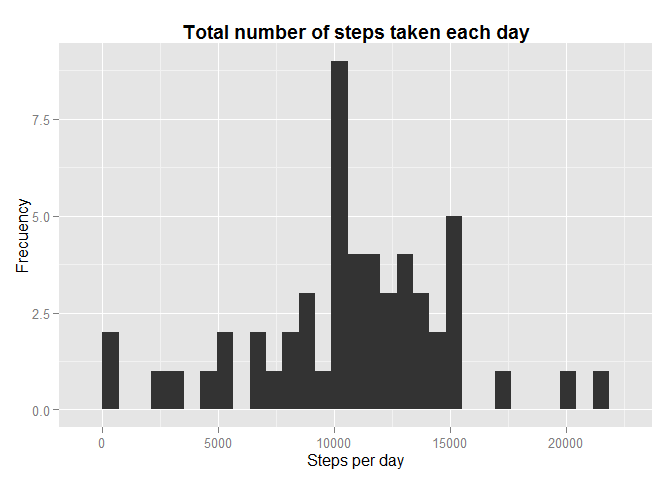
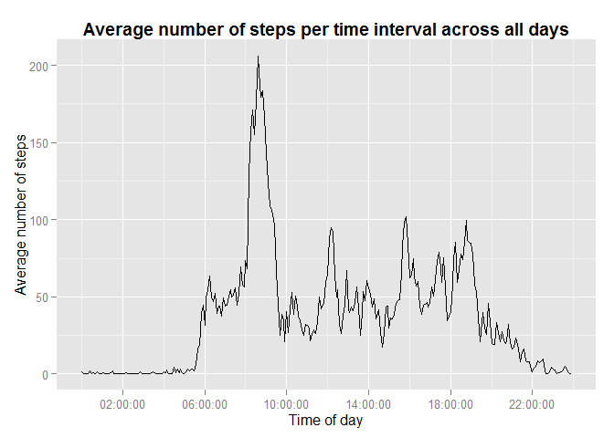
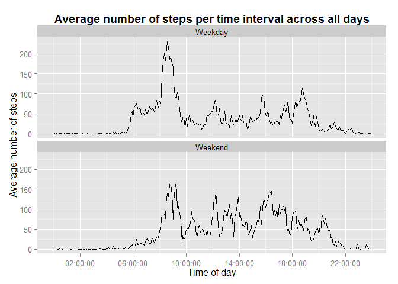

Reproducible Research: Peer Assessment 1
------------------------------------------


### Loading and preprocessing the data

The following section of code depicts how to load the data set and perform 
necessary preprocessing on it.


```r
# Loading the necessary libraries
library(plyr)
library(ggplot2)
library(scales)
# The following 2 lines to save the images in the figures directory, other way 
# would not be necessary and required only do so in the first chunk
library(knitr)
opts_chunk$set(fig.path = 'figures/')

# Setting the working directory
setwd("C:\\Users\\admin\\Desktop\\Coursera\\Reproducible Research\\RepData_PeerAssessment1")  

# We review whether the activity.csv file exists, if not exist, the activity.zip
# file is decompressed to obtain it because the data to work is contained in it
if("activity.csv" %in% dir() == FALSE){
  unzip("activity.zip")  
}

# Loading the data in data frame
activity <- read.csv("activity.csv")

# Transforming the interval variable to POSIXct format
activity$hora <- sprintf("%04d", activity$interval)
activity$hora <- strptime(paste(activity$hora, ":00", sep=""), "%H%M")
activity$hora <- as.POSIXct(activity$hora)

# Transforming the date variable to Date format
activity$date <- as.Date(activity$date)
```
    

### What is mean total number of steps taken per day?

This sections consists of code to remove the missing values and plot a histogram
of the number of steps taken each day and report the `mean` and `median` of the 
number of steps taken each day.


```r
# Removing the missing values
ActivityClean <-activity[!is.na(activity$steps), ]


# Performing aggregation to get the total sum of steps for each date
report <- ddply(ActivityClean,
                .(date),
                summarise,
                total  = sum(steps),
                stringsAsFactors = F
               )

# Disabling scientific notation
options(scipen=999)

# Calculating the mean and median
meanStep   <- round(mean(report$total), 2)
medianStep <- round(median(report$total), 2)

# Plotting the histogram the number of steps taken each day
histograma <- ggplot(report, aes(x=total)) +
              geom_histogram(binwidth = diff(range(report$total))/30) +
              ggtitle("Total number of steps taken each day") +
              theme(plot.title = element_text(lineheight=.8, face="bold")) +
              xlab("Steps per day") + 
              ylab("Frecuency")
print(histograma)
```

 


From the above calculations, we obtain the following results.

* __Mean__ total number of steps taken per day: __10766.19__
* __Median__ total number of steps taken per day: __10765__

### What is the average daily activity pattern?

In this section, we will make a time-series plot of the five minute interval vs.
the average number of steps taken


```r
# Calculating the average of steps for each time interval
report <- ddply(ActivityClean,
                .(hora),
                summarise,
                mean = mean(steps),
                stringsAsFactors = F
               )

# Checking which five minute interval contains the maximum number of steps taken
maxRowIndex <- which.max(report$mean)
maxInterval <- format(report[maxRowIndex, 'hora'], "%H:%M:%S")
maxAvgStep  <- round(report[maxRowIndex, 'mean'], 2)

# Plotting the time-series graph as required
TimeSeries <- ggplot(report, aes(x=hora, y=mean, group=1)) + 
              geom_line() +
              ggtitle("Average number of steps per time interval across all days") +
              theme(plot.title = element_text(lineheight=.8, face="bold")) +
              xlab("Time of day") + 
              ylab("Average number of steps") +
              scale_x_datetime(breaks = date_breaks("4 hour"), labels = date_format("%H:%M:%S"))

print(TimeSeries)
```

 

Thus we observe from the data set that, on an average across all the days,
the __'08:35:00'__ five minute interval contains the maximum number of 
steps i.e, __( 206.17 steps )__


### Imputing missing values

In this section we look closely at the missing data in our data set and see if 
the presence of missing data might cause any bias in our data, we also see the 
effects of imputing these missing values.


```r
# Calulating the total number of missing values in the dataset
missingCount <- sum(is.na(activity$steps))
```

The total number of missing values in the dataset are: __2304__

I will fil the missing values with the average number of steps taken on that 
interval, averaged across all days.


```r
# Creating a new dataset that is same as the orginal dataset
dataFilled <- activity

# Getting the corresponding intervals
nas_rows <- is.na(dataFilled$steps)

# Filling the missing intervals with the mean of the corresponding five minute 
# interval
dataFilled[nas_rows,]$steps = sapply(dataFilled[nas_rows,]$hora,
                                     function(x) report[report$hora == x, ]$mean)

# Performing aggregation to get the new total sum of steps for each date
newReport <- ddply(dataFilled,
                   .(date),
                   summarise,
                   total  = sum(steps),
                   stringsAsFactors = F
                  )

# Plotting the histogram the number of steps taken each day
histograma <- ggplot(newReport, aes(x=total)) +
              geom_histogram(binwidth = diff(range(newReport$total))/30) +
              ggtitle("Total number of steps taken each day with NA's steps arranged") +
              theme(plot.title = element_text(lineheight=.8, face="bold")) +
              xlab("Steps per day") + 
              ylab("Frecuency")

print(histograma)
```

 

```r
# Calculating the mean and median
totalStepsFilledMean   <- round(mean(newReport$total), 2)
totalStepsFilledMedian <- round(median(newReport$total), 2)
```

From the above calculations, we obtain the following results.

 * __Mean__ total number of steps taken per day: __10766.19__
 * __Median__ total number of steps taken per day: __10766.19__  
 

Impact of imputing the missing data:

 * The mean number of steps taken per day are still the same (__10766.19__). 
 * The median number of steps taken per day are slightly different now (before __10765__,
   after: __10766.19__).


### Are there differences in activity patterns between weekdays and weekends?

In this section we will try to find out if there are any differences in the 
activity patterns between weekdays and weekends.


```r
# Changing locale time to English
Sys.setlocale("LC_TIME", "english")
```

```
## [1] "English_United States.1252"
```

```r
# Creating a new factor variable 'day' with two levels 'Weekday' and 'Weekend'
dataFilled$day <- factor(ifelse(weekdays(dataFilled$date) %in% 
                                  c("Saturday","Sunday"),"Weekend", "Weekday"))

newReport <- ddply(dataFilled,
                   .(hora, day),
                   summarise,
                   mean  = mean(steps),
                   stringsAsFactors = F
                  )
 
# Plotting the time-series graph as required
TimeSeries <- ggplot(newReport, aes(x=hora, y=mean, group=1)) + 
              geom_line() +
              ggtitle("Average number of steps per time interval across all days") +
              theme(plot.title = element_text(lineheight=.8, face="bold")) +
              xlab("Time of day") + 
              ylab("Average number of steps") +
              scale_x_datetime(breaks = date_breaks("4 hour"), labels = date_format("%H:%M:%S")) +
              facet_wrap(~day, ncol= 1)

print(TimeSeries)
```

 

From the above plot, we observe that there is a higher peak in the number of 
steps taken, between the `08:00` and `10:00` hrs, (i.e, early morning) on 
weekdays rather than on weekends. Besides this, we can also observe that, higher
peaks in the number of steps taken occur from late morning till evening, on 
weekends rather than weekdays which is expected.
